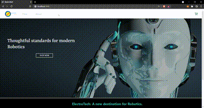

# ElectroTech
<div align="center">
 <h1>A sneak peek into what we have here</h1>
 



</div>

## Technology Stack 🛠️


- **Coding Languages**:   

- **Project Management Tools**:  

## TODO

- [ ] Home Page crousel 
- [ ] Category Filter
- [ ] Tracking of shipment page
- [ ] Register and Sign-in pop-up page 
- [ ] Add to Wishlist.
- [ ] Chat with us bot
- [ ] Item Search Bar

## Bugs
- [ ]

## Environment Setup for local use-

* Drop a :star: on the GitHub repository.
<br/>

* Download [Git](https://git-scm.com/downloads) (when you install Git, Git Bash also gets installed by default)
<br/>

* Download and install a code/ text editor.
    - Recommended-
        - [Download VS Code](https://code.visualstudio.com/download)
        - [Download Atom](https://atom.io/)
<br/> <br/>

### Installation using NPM 

* Download [Node Js and npm(Node package manager)](https://nodejs.org/en/) (when you install Node, npm also gets installed by default)
<br/>


* Clone the repository by running command
```
git clone https://github.com/<your user-name>/ElectroTech.git
```
in your git bash.
<br/>

* Run command `cd ElectroTech`.
<br/>

* Run this command to install all dependencies for the project.
```
npm install
```

<br/>

* Run this command to start the project.
```
npm start
```

or

* Run this command to start the project as a developer.
```
npm run dev
```
<br/>

* Open link to view the website in your browser window if it doesn't open automatically.
```
http://localhost:3000/
```
<br/>

## Project Admins ✨
<table>
  <tr>
    <td align="center"><a href="https://github.com/naqeeb2710"><br /><sub><b>Naqeeb Ahmed<br/>
    <td align="center"><a href="https://github.com/Furquan712"><br /><sub><b>Syed Md Furquan<br/>
    
  </tr>
</table>

## Maintainers ✨
<table>
  <tr>
    <td align="center"><a href="https://github.com/saquibk765"><br /><sub><b>saquib Khan<br/>
    <td align="center"><a href="https://github.com/muazaqdas"><br /><sub><b>Muaz Aqduas<br/>
    <td align="center"><a href="https://github.com/ritikmasand"><br /><sub><b>Ritik Masand<br/>
     <td align="center"><a href="https://github.com/abdul0808"><br /><sub><b>Abdul Rehman<br/>
       <td align="center"><a href="https://github.com/Abhay-Jyot7"><br /><sub><b>Abhay Jyot<br/>
    
  </tr>
</table>

